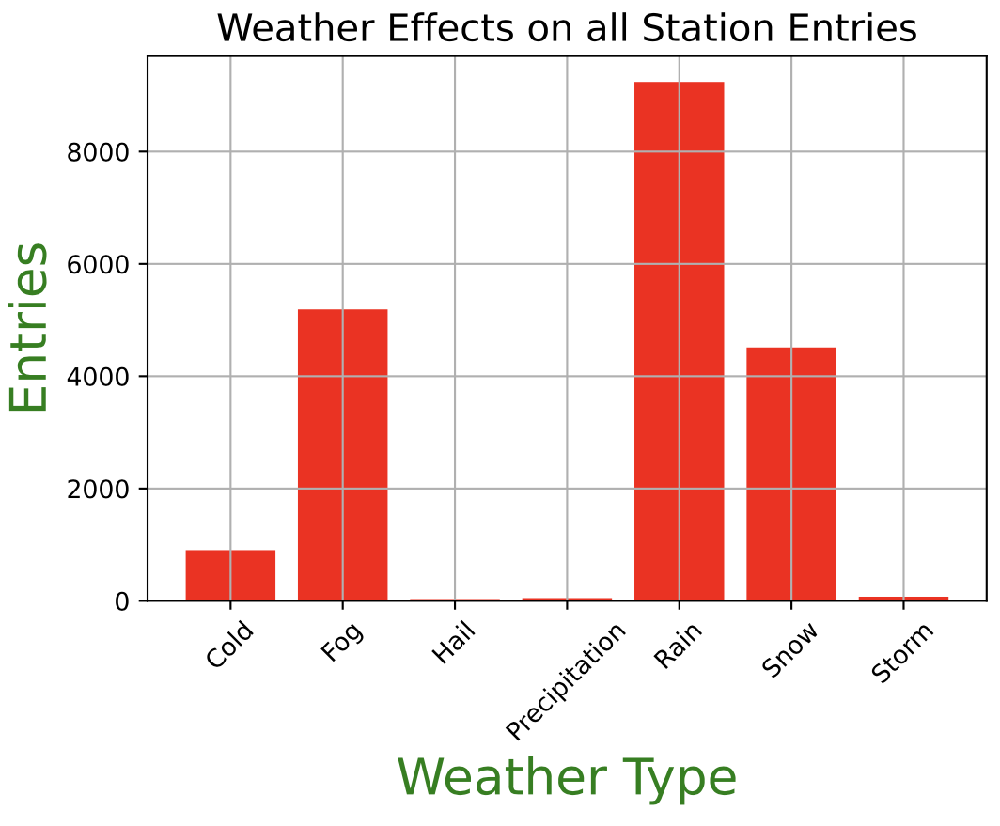
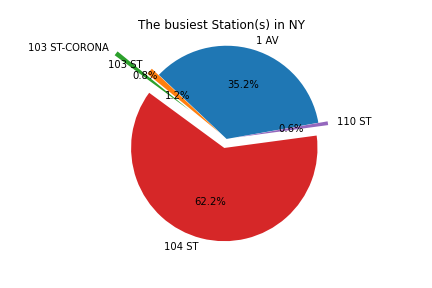
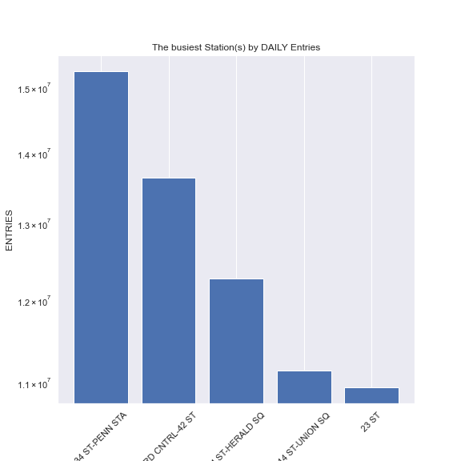
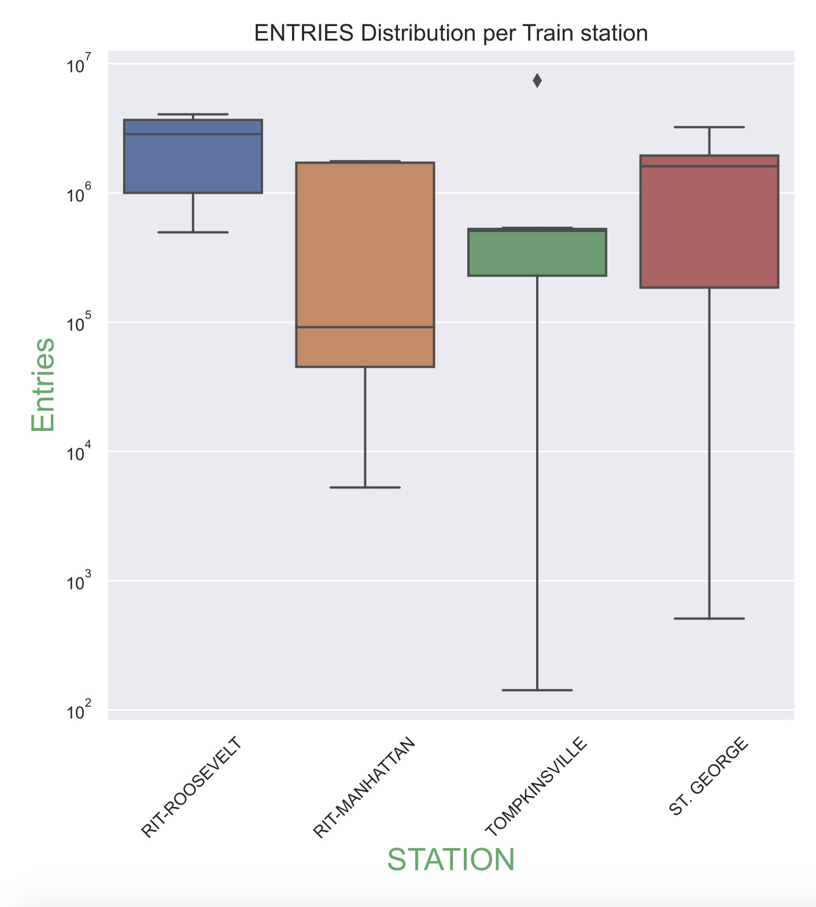
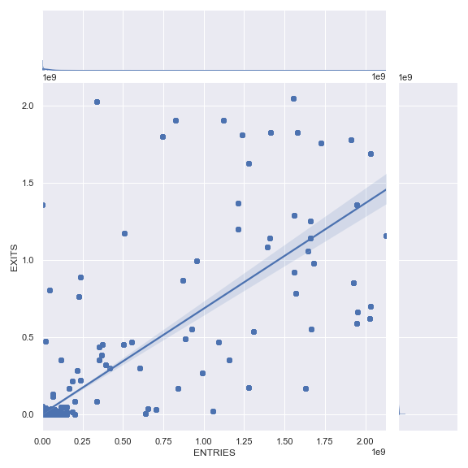
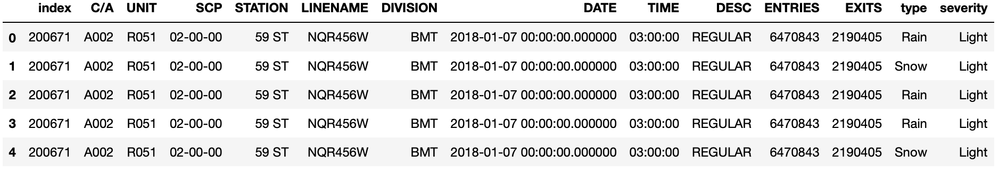

# Turnstile Data Analysis

Morooj Aldeeb

## Introduction

BACK Story:
--------------

We have downloaded weather data set from KAGGLE website and we joined the weather data for the same period taken from the turnstile data by date column. We combined two additional columns from the weather data set (Weather type and Severity) into the turnstile columns.

Resources
=========

- Weather Data was downloaded from KAGGLE , http://www.kaggle.com
- Turnstile data was downloaded from MTA website, http://web.mta.info

Initial Data Features
-----------------------

Following the original web resource, the data set records have been collected based on 11 fields. Most of the fields are text-based categorical variables, one date and another time field in addition to 2 numerical fields that represent cumulative entries and exits from each station. 
Each data record describes a single recording event every 4 hours by a single device deployed at a given identified train station.

# Research Question

- What are the busiest stations based on entries (in 4 months in 2018) for awareness leaflets about weather conditions in crowded ?

- Is there any relationship between size of the train station and the traffic ?
 
- Does the daily weather affect the train transportation?

# Approach

In this project, we are going to propose a set of questions which tailor or guide the overall data analysis approach that will be taken in order to better understand the data and gain more insights from it to instruct future decisions. We are going to collect 6 Month(s) worth of data from the whole dataset for explanatory data analysis and hypothesis derivation.

We investigated whether the weather affects the number of people utilizing railways for daily transportation. For this, we grouped data by the “Weather Type” against the counts of ENTRIES 
with respect to the weather type.

The bar plot clearly shows that stormy days experience the lowest traffic to train stations. On Contrary, train transportation seems unaffected during light rainy days.

The Top 5 busiest Train Stations by Average of Entries
===========================================

As can be seen from the PIE Chart, 104 ST is the busiest station by the average ENTRIES in the first fourth months of 2018 followed by 1 AV. 

Moreover, We have constructed the daily entries for all stations, sorted them in descending order and picked the top 5 stations by daily entries, shown below.

To investigate the distribution of ENTRIES pattern(s) per Train station, We constructed the box plot per station(s) which clearly shows different distribution(s) depending upon the given station. this difference might be attributed to the location of the train station in NY.

### Correlation between ENTRIES and EXITS

Logically, there should be relationship or correlation between Entries and Exits in the data since who goes in should goes out from the train station. We investigated that correlation statistically in the data by plotting a scatter plot and superimposing the pearson correlation coefficients on the data points. There is approximately 80% positive relationship between ENTRIES and EXITS which aligns very well with the logic.

Joined Weather Data with Turnstile by DATE
===================================

End User Benefits
---------------------
- The conclusions from this explanatory data analysis project are very important to different audiences, including but not limited to the government of US, Transportation ministry in US, Marketing companies and passengers themselves.

- I want to take advantage of crowded stations and stations in poor places to publish awareness leaflets about weather conditions in crowded and poor neighborhoods.

## Future work

 - we can try to predict the size of the train station based on knowing the exits and entries in a station which might help authorities in designing better train stations to accommodate in advance the influx of people at specified geographical location.
 - can predict the traffic flow given a particular weather condition.
 - can predict weather condition to publish awareness leaflets like (SMS)

Datasets and libraries
=================

Datasets:
1- MTA turnstile dataset ( [06-01-2018] to [30-04-2018] )

2- Weather dataset ( [06-01-2018] to [30-04-2018] )

(1926904 rows , 25 columns)

Used Tools:
=========
Jupyter notebook ,Python 

Used libraries:
============
Pandas , NumPy , Matplotlib , Seaborn , SQLite , sqlalchemy

